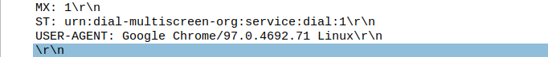

## a. Which browser is being used by the host with IP 10.0.0.69?

Used filter: `ip.addr==10.0.0.69 and http.user_agent `
The host is using Chrome with a Linux distribution, and seems to be on a Dell Inspiron based on the host name.

## b. What can you infer about the packets exchanged between 10.0.0.69 and port 22 of 45.33.32.156 around timestamp 1:21:30?

From the looks of it in the *Info* column, the host at 10.0.0.69 initiates a tcp handshake via port 22 to the host at 45.33.32.156 by sending a [SYN] packet and then receives a [SYN,ACK] back from host 45.33.32.156. Then 10.0.0.69 sends another [ACK], and then ends and resets the tcp connection with [RST, ACK], ending the communication line.

## c. What can you infer about the packets exchanged between the same hosts around timestamp 1:23:05? Characterize the differences between this and the previous question.

Similar to the previous quiestion, but it looks like the sender, host 10.0.0.69 trys to make a tcp connection with host 45.33.32.156, but this time it seems like host 10.0.0.69 ends the communications without sending an [ACK] to the previous [SYN,ACK] and just straight up terminates the connection with a [RST].

## d. I accidentally sent my password over http! Can you take advantage and compromise my account? What is my password?

Filter entries by HTTP, then look for the POST request with the plain text user name and password below:

